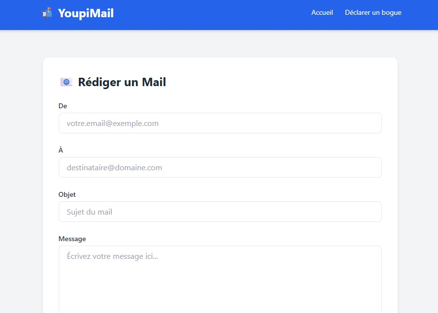

# CTF Web Serveur - Faille Doctype PUG 0-day

## Présentation du CTF 
**ID** 4 dans **les CTFs de Cyrhades**

Injection XSS : Via un doctype, commencer par chercher sur le site, pour trouver le mail que j'avais envoyé.
à l'Agence nationale de la sécurité des systèmes d'information (ANSSI)

Ce problème n'ayant jamais été pris en considération cela en fait une faille 0-day. Il est de difficulté 3 car il n'y a aucun moyen de trouver d'information sur internet, vous devrez analyser le code source de PUG pour voir comment est utilisé le doctype dans PUG.

## Aperçu

-----------

## Installation manuel
Vous n'utilisez pas l'application **les CTFs de Cyrhades** ? C'est dommage !
Mais voici comment installer ce CTF manuellement :

> git clone https://github.com/Hack-Oeil/NODE_PUG_DOCTYPE_ZERO_DAY.git

> cd NODE_PUG_DOCTYPE_ZERO_DAY && docker compose up

